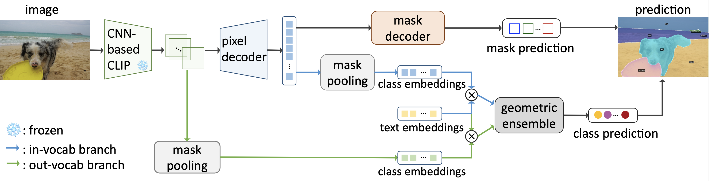

# Convolutions Die Hard: Open-Vocabulary Segmentation with Single Frozen Convolutional CLIP (NeurIPS 2023)

[](https://paperswithcode.com/sota/open-vocabulary-panoptic-segmentation-on?p=convolutions-die-hard-open-vocabulary-1)
[](https://paperswithcode.com/sota/open-vocabulary-semantic-segmentation-on-3?p=convolutions-die-hard-open-vocabulary-1)
[](https://paperswithcode.com/sota/open-vocabulary-semantic-segmentation-on?p=convolutions-die-hard-open-vocabulary-1)
[](https://paperswithcode.com/sota/open-vocabulary-semantic-segmentation-on-9?p=convolutions-die-hard-open-vocabulary-1)
[](https://paperswithcode.com/sota/open-vocabulary-semantic-segmentation-on-2?p=convolutions-die-hard-open-vocabulary-1)
[](https://paperswithcode.com/sota/open-vocabulary-semantic-segmentation-on-7?p=convolutions-die-hard-open-vocabulary-1)
[](https://paperswithcode.com/sota/open-vocabulary-semantic-segmentation-on-5?p=convolutions-die-hard-open-vocabulary-1)
[](https://paperswithcode.com/sota/open-vocabulary-semantic-segmentation-on-1?p=convolutions-die-hard-open-vocabulary-1)

This repo contains the code for our paper [**Convolutions Die Hard: Open-Vocabulary Segmentation with Single Frozen Convolutional CLIP**](https://arxiv.org/abs/2308.02487)

<div align="center">
  
</div><br/>

*FC-CLIP* is an universal model for open-vocabulary image segmentation problems, consisting of a class-agnostic segmenter, in-vocabulary classifier, out-of-vocabulary classifier. With everything built upon a shared single frozen convolutional CLIP model, *FC-CLIP* not only achieves state-of-the-art performance on various open-vocabulary segmentation benchmarks, but also enjoys a much lower training (3.2 days with 8 V100) and testing costs compared to prior arts.


## Installation

See [installation instructions](INSTALL.md).

## Getting Started

See [Preparing Datasets for FC-CLIP](datasets/README.md).

See [Getting Started with  FC-CLIP](GETTING_STARTED.md).

We also support FC-CLIP with [HuggingFace 🤗 Demo](https://huggingface.co/spaces/fun-research/FC-CLIP)

## Model Zoo

<table>
<thead>
  <tr>
    <th align="center"></th>
    <th align="center" style="text-align:center" colspan="3"><a href="logs/testing/ade20k.log">ADE20K(A-150)</th>
    <th align="center" style="text-align:center" colspan="3"><a href="logs/testing/cityscapes.log">Cityscapes</th>
    <th align="center" style="text-align:center" colspan="2"><a href="logs/testing/mapillary_vistas.log">Mapillary Vistas</th>
    <th align="center" style="text-align:center"><a href="logs/testing/a-847.log">ADE20K-Full <br> (A-847)</th>
    <th align="center" style="text-align:center"><a href="logs/testing/pc-59.log">Pascal Context 59 <br> (PC-59)</th>
    <th align="center" style="text-align:center"><a href="logs/testing/pc-459.log">Pascal Context 459 <br> (PC-459)</th>
    <th align="center" style="text-align:center"><a href="logs/testing/pc-21.log">Pascal VOC 21 <br> (PAS-21) </th>
    <th align="center" style="text-align:center"><a href="logs/testing/pc-20.log">Pascal VOC 20 <br> (PAS-20) </th>
    <th align="center" style="text-align:center" colspan="3"><a href="logs/testing/coco.log">COCO <br> (training dataset)</th>
    <th align="center" style="text-align:center">download </th>
  </tr>
</thead>
<tbody>
  <tr>
    <td align="center"></td>
    <td align="center">PQ</td>
    <td align="center">mAP</td>
    <td align="center">mIoU</td>
    <td align="center">PQ</td>
    <td align="center">mAP</td>
    <td align="center">mIoU</td>
    <td align="center">PQ</td>
    <td align="center">mIoU</td>
    <td align="center">mIoU</td>
    <td align="center">mIoU</td>
    <td align="center">mIoU</td>
    <td align="center">mIoU</td>
    <td align="center">mIoU</td>
    <td align="center">PQ</td>
    <td align="center">mAP</td>
    <td align="center">mIoU</td>
  </tr>
    <td align="center"><a href="configs/coco/panoptic-segmentation/fcclip/fcclip_convnext_large_eval_ade20k_r50.yaml"> FC-CLIP (ResNet50) </a></td>
    <td align="center">17.9</td>
    <td align="center">9.5</td>
    <td align="center">23.3</td>
    <td align="center">40.3</td>
    <td align="center">21.6</td>
    <td align="center">53.2</td>
    <td align="center">15.9</td>
    <td align="center">24.4</td>
    <td align="center">7.1</td>
    <td align="center">50.5</td>
    <td align="center">12.9</td>
    <td align="center">75.9</td>
    <td align="center">89.5</td>
    <td align="center">50.7</td>
    <td align="center">40.7</td>
    <td align="center">58.8</td>
    <td align="center"><a href="https://drive.google.com/file/d/1tcB-8FNON-LwckXQbUyKcBA2G7TU65Zh/view?usp=sharing"> checkpoint </a></td>
  </tr>
  <tr>
    <td align="center"><a href="configs/coco/panoptic-segmentation/fcclip/fclip_convnext_large_eval_ade20k_r101.yaml"> FC-CLIP (ResNet101) </a></td>
    <td align="center">19.1</td>
    <td align="center">10.2</td>
    <td align="center">24.0</td>
    <td align="center">40.9</td>
    <td align="center">24.1</td>
    <td align="center">53.9</td>
    <td align="center">16.7</td>
    <td align="center">23.2</td>
    <td align="center">7.7</td>
    <td align="center">48.9</td>
    <td align="center">12.3</td>
    <td align="center">77.6</td>
    <td align="center">91.3</td>
    <td align="center">51.4</td>
    <td align="center">41.6</td>
    <td align="center">58.9</td>
    <td align="center"><a href="https://drive.google.com/file/d/1P0mdgftReWzVbPQ0O0CSBfW3krHhTOj0/view?usp=sharing"> checkpoint </a></td>
  </tr>
  <tr>
    <td align="center"><a href="configs/coco/panoptic-segmentation/fcclip/fcclip_convnext_large_eval_ade20k_r50x4.yaml"> FC-CLIP (ResNet50x4) </a></td>
    <td align="center">21.8</td>
    <td align="center">11.7</td>
    <td align="center">26.8</td>
    <td align="center">42.2</td>
    <td align="center">23.8</td>
    <td align="center">54.6</td>
    <td align="center">17.4</td>
    <td align="center">24.6</td>
    <td align="center">8.7</td>
    <td align="center">54.0</td>
    <td align="center">13.1</td>
    <td align="center">79.0</td>
    <td align="center">92.9</td>
    <td align="center">52.1</td>
    <td align="center">42.8</td>
    <td align="center">60.4</td>
    <td align="center"><a href="https://drive.google.com/file/d/1nUpUsNUE22eOV9skxv9IyIkmCbg5jrIF/view?usp=sharing"> checkpoint </a></td>
  </tr>
  <tr>
    <td align="center"><a href="configs/coco/panoptic-segmentation/fcclip/fcclip_convnext_large_eval_ade20k_r50x16.yaml"> FC-CLIP (ResNet50x16) </a></td>
    <td align="center">22.5</td>
    <td align="center">13.6</td>
    <td align="center">29.4</td>
    <td align="center">42.0</td>
    <td align="center">25.6</td>
    <td align="center">56.0</td>
    <td align="center">17.8</td>
    <td align="center">26.1</td>
    <td align="center">10.3</td>
    <td align="center">56.4</td>
    <td align="center">15.7</td>
    <td align="center">80.7</td>
    <td align="center">94.5</td>
    <td align="center">54.4</td>
    <td align="center">45.0</td>
    <td align="center">63.3</td>
    <td align="center"><a href="https://drive.google.com/file/d/1rJu2UwwtI0VLDl9CyB8Mkgw9qHlnX70W/view?usp=sharing"> checkpoint </a></td>
  </tr>
  <tr>
    <td align="center"><a href="configs/coco/panoptic-segmentation/fcclip/fcclip_convnext_large_eval_ade20k_r50x64.yaml"> FC-CLIP (ResNet50x64) </a></td>
    <td align="center">22.8</td>
    <td align="center">13.6</td>
    <td align="center">28.4</td>
    <td align="center">42.7</td>
    <td align="center">27.4</td>
    <td align="center">55.1</td>
    <td align="center">18.2</td>
    <td align="center">27.3</td>
    <td align="center">10.8</td>
    <td align="center">55.7</td>
    <td align="center">16.2</td>
    <td align="center">80.3</td>
    <td align="center">95.1</td>
    <td align="center">55.6</td>
    <td align="center">46.4</td>
    <td align="center">65.3</td>
    <td align="center"><a href="https://drive.google.com/file/d/1rvfFVp5p3PZQsHp2NGVEBeYYcqgVVaZX/view?usp=sharing"> checkpoint </a></td>
  </tr>
  <tr>
    <td align="center"><a href="configs/coco/panoptic-segmentation/fcclip/fcclip_convnext_large_eval_ade20k.yaml"> FC-CLIP (ConvNeXt-Large) </a></td>
    <td align="center">26.8</td>
    <td align="center">16.8</td>
    <td align="center">34.1</td>
    <td align="center">44.0</td>
    <td align="center">26.8</td>
    <td align="center">56.2</td>
    <td align="center">18.3</td>
    <td align="center">27.8</td>
    <td align="center">14.8</td>
    <td align="center">58.4</td>
    <td align="center">18.2</td>
    <td align="center">81.8</td>
    <td align="center">95.4</td>
    <td align="center">54.4</td>
    <td align="center">44.6</td>
    <td align="center">63.7</td>
    <td align="center"><a href="https://drive.google.com/file/d/1-91PIns86vyNaL3CzMmDD39zKGnPMtvj/view?usp=sharing"> checkpoint </a></td>
  </tr>
  <tr>
</tbody>
</table>

## <a name="Citing FC-CLIP"></a>Citing  FC-CLIP

If you use FC-CLIP in your research, please use the following BibTeX entry.

```BibTeX
@inproceedings{yu2023fcclip,
  title={Convolutions Die Hard: Open-Vocabulary Segmentation with Single Frozen Convolutional CLIP},
  author={Qihang Yu and Ju He and Xueqing Deng and Xiaohui Shen and Liang-Chieh Chen},
  booktitle={NeurIPS},
  year={2023}
}
```

## Acknowledgement

[Mask2Former](https://github.com/facebookresearch/Mask2Former)

[ODISE](https://github.com/NVlabs/ODISE)
